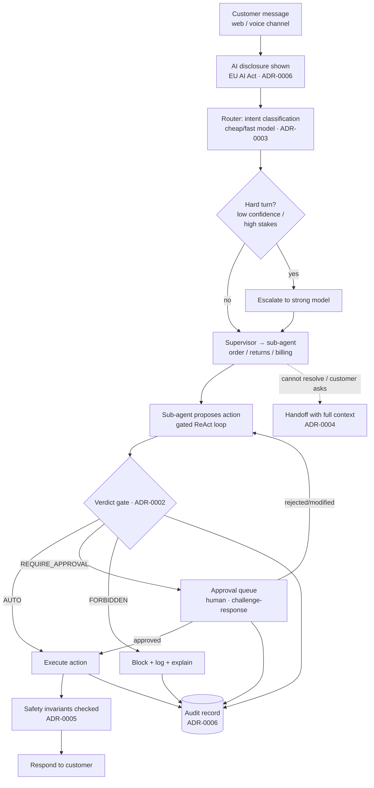

# Architecture

> This document is deliberately downstream of the [decisions](../decisions). The architecture exists to *serve* the decisions, not the other way around — so every component below links back to the ADR that justifies it. If you haven't read the [README](../README.md) yet, start there; this is the evidence underneath it.

This is a reference design. The shape reflects patterns I've run in production (LangGraph orchestration, cascaded multi-provider inference, a gated ReAct loop, CI evaluation), adapted to a customer-support context.

---

## The stance

A support agent is a production service that takes consequential actions on behalf of a business. The architecture is organised around one idea: **the model proposes, policy disposes, and everything is reconstructable.** No action reaches a customer or a system of record without passing the verdict gate ([ADR-0002](../decisions/0002-bounded-autonomy.md)) and the eval gate ([ADR-0005](../decisions/0005-evaluation-gate.md)), and every step it took is logged for audit ([ADR-0006](../decisions/0006-governance-audit.md)).

---

## Request flow

---

## Components

### Orchestration — LangGraph supervisor + bounded sub-agents
A supervisor routes each conversation to a sub-agent scoped to one issue category (order status, returns, billing). Sub-agents run a **gated ReAct loop**: they reason and propose tool actions, but every consequential action is intercepted by the verdict gate before execution. Bounded scope per sub-agent keeps the problem tractable and the eval surface small — it's the same reason the product scope is deliberately narrow ([README](../README.md)).

### Routing layer — cascaded, multi-provider
A first-class component, not a hidden `if`. A cheap/fast model handles intent and the easy majority of turns; hard turns (low router confidence, multi-step reasoning, financial/sensitive context) escalate to a stronger model, and the router defaults *up* when unsure. More than one provider gives resilience: a provider outage degrades rather than halts. Rationale and tradeoffs in [ADR-0003](../decisions/0003-cost-routing.md).

### Verdict gate — AUTO / REQUIRE_APPROVAL / FORBIDDEN
Sits between *proposal* and *execution* on every consequential action. Classification is policy-driven by blast radius and reversibility — not by model confidence. `AUTO` executes; `REQUIRE_APPROVAL` routes to a human via the approval queue with a challenge-response prompt; `FORBIDDEN` blocks, logs, and explains. New action types default to `REQUIRE_APPROVAL` until they earn `AUTO`. See [ADR-0002](../decisions/0002-bounded-autonomy.md).

### Tool layer
Each tool (order lookup, return initiation, refund, credit, address change) carries a verdict classification and a data-access scope. Tools are the only path to side effects, so the gate has a complete chokepoint — there is no way for a sub-agent to act except through a classified tool.

### Escalation & handoff
When a sub-agent can't resolve, hits a `REQUIRE_APPROVAL` it can't satisfy, or the customer asks for a person, the handoff packages a structured summary (who, what, attempted, blocked) plus the full thread and the agent's reasoning, delivered into the human agent's desktop. Escalation is a designed experience, not a dropped session. See [ADR-0004](../decisions/0004-escalation-context.md).

### Evaluation harness (CI)
Gates every deploy. **Deterministic safety invariants** (no unauthorized refund promise, no invented policy, no third-party data exposure, no action exceeding its verdict) block merge on failure. **Golden cases** catch regressions; an LLM-judge grades qualitative/tone cases above the safety line. The golden set is continuously fed by production escalations and reopens. See [ADR-0005](../decisions/0005-evaluation-gate.md).

### Observability & audit
Every decision, routing choice, verdict, approval, and action is written to a structured, queryable audit record with PII redaction and a retention policy. This is what makes any interaction reconstructable (Part B of the [sample audit report](../artifacts/sample-audit-report.md)) and the period rollup possible (Part A). See [ADR-0006](../decisions/0006-governance-audit.md).

### State & persistence
Conversation state is checkpointed so a session survives restarts and a handoff can carry full history. The approval queue is a durable, ordered queue so an action awaiting a human is never lost and never executed twice.

---

## A representative interaction (billing dispute)

1. Customer opens chat; AI disclosure shown.
2. Router classifies intent (*duplicate charge*) on the cheap model, high confidence.
3. Supervisor routes to the billing sub-agent.
4. Sub-agent retrieves recent transactions (scoped, lawful-basis logged), identifies a duplicate.
5. It reasons that a refund is warranted — the router escalates this turn to the strong model because it's a financial action.
6. Sub-agent proposes *refund €49 to original method* → verdict gate.
7. Below the auto ceiling but touches a payment instrument → `REQUIRE_APPROVAL` → approval queue.
8. Human approves via challenge-response (amount, recipient, reversibility, evidence) in ~1 min.
9. Action executes; safety invariants checked at response time; confirmation sent.
10. Every step above is in the audit record.

---

## Failure modes & resilience

| Failure | Behaviour |
|---|---|
| Primary model provider down | Router fails over to alternate provider; degrade, don't halt ([ADR-0003](../decisions/0003-cost-routing.md)) |
| Router uncertain | Escalates *up* to the stronger model — cheap-model errors are the expensive kind here |
| Unknown / out-of-scope action | Defaults to `REQUIRE_APPROVAL` or `FORBIDDEN`, never silent `AUTO` ([ADR-0002](../decisions/0002-bounded-autonomy.md)) |
| Approval queue backs up | SLA tracked on the scorecard; breaches are a standing review item ([ADR-0001](../decisions/0001-balanced-scorecard.md)) |
| Bad change tries to ship | Eval gate blocks at merge on any safety-invariant failure ([ADR-0005](../decisions/0005-evaluation-gate.md)) |

---

## Technology choices and the buy boundary

| Layer | Choice | Why | Build / Buy |
|---|---|---|---|
| Channels, telephony, agent desktop, CRM | Platform vendor | Undifferentiated, solved better by vendors | **Buy** ([ADR-0007](../decisions/0007-build-vs-buy.md)) |
| Orchestration & verdict gate | LangGraph, custom gate | Encodes *this* company's risk policy | **Build** |
| Cost routing | Custom cascaded router | Owns the unit economics | **Build** |
| Evaluation | Custom CI harness | The safety system; must be ours | **Build** |
| State / queue / audit store | Managed infra (e.g. durable queue, checkpoint store, log store) | Operational plumbing | **Buy / managed** |

A plausible deployment runs the built layers as containerised services (e.g. ECS Fargate), the approval queue on a durable ordered queue (e.g. FIFO SQS), conversation/checkpoint state in a managed store (e.g. DynamoDB), and tracing via OpenTelemetry into an LLM-observability tool (e.g. Langfuse). The built layers are kept **portable** so the platform underneath them can change without rewriting the risk policy — the deliberate guardrail against lock-in from [ADR-0007](../decisions/0007-build-vs-buy.md).

---

*Reference architecture for a design by Praveen Kumar. Deployment specifics are illustrative; the load-bearing content is the mapping from each component back to the decision that justifies it.*
